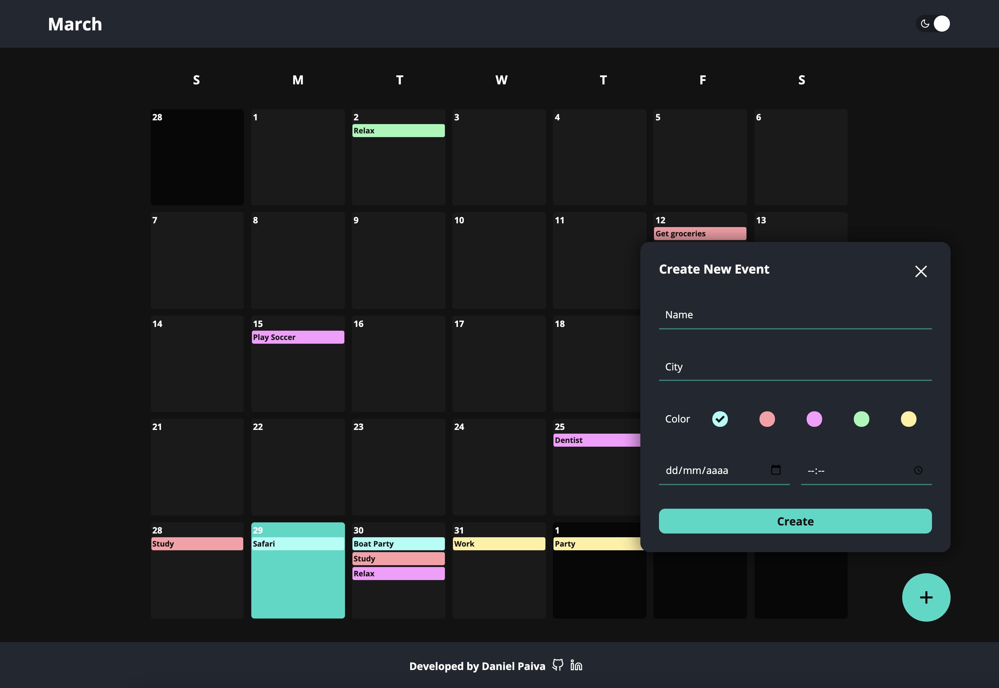

# My Calendar

<p align="center">
  
</p>

<p align="center">
The project is deployed and can be 
 <a href="https://calendar-seven.vercel.app/">accessed here!</a>
</p>

## Getting Started

This project a simple calendar view of the current month where you can add events and reminders.

## Instructions

- On the main screen, click "+" to add a reminder.
- Click on any day to see the events for that day, edit and delete events.

### Built With:

- [React](https://reactjs.org/) - A JavaScript library for building user interfaces.
- [TypesCript](https://www.typescriptlang.org/) - A strict syntactical superset of JavaScript and adds optional static typing to the language.
- [Redux](https://redux.js.org/) - A Predictable State Container for JS Apps.
- [Jest](https://jestjs.io/) - Jest is a delightful JavaScript Testing Framework with a focus on simplicity.
- [Styled Components](https://styled-components.com/) - A library for React and React Native that allows you to use component-level styles in your application that are written with a mixture of JavaScript and CSS using a technique called CSS-in-JS.
- [OpenWeather API](https://openweathermap.org/api) - API used to fetch the weather data.
- [Vercel](https://vercel.com/) - Cloud platform where the project is deployed.

### Installation

1. Clone the repository.

```sh
git clone https://github.com/danielcspaiva/calendar.git
```

2. Install packages.

```sh
yarn install || npm install
```

3. Run the app.

```sh
yarn start || npm start
```

4. Run the tests.

```sh
yarn test || npm run test
```

5. Open [http://localhost:3000](http://localhost:3000) to view it in the browser.

---

Built by Daniel Paiva
